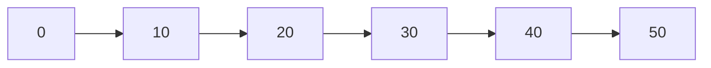

# 📦 Array (Vetor)

## 📝 Descrição

O **Array (Vetor)** é uma estrutura de dados linear que armazena elementos do mesmo tipo em posições contíguas de memória. Pode ser estático (tamanho fixo definido na compilação) ou dinâmico (tamanho alocado em tempo de execução).

## 📍 Exemplos de Aplicações

- Armazenamento de notas de alunos
- Lista de temperaturas diárias
- Pixels em uma imagem
- Tabelas e planilhas
- Buffers de dados

## ⚙️ Operações Fundamentais

### 🔼 Inserção

> Adiciona um elemento em uma posição específica do array.

Exemplo com índice específico:
```c
array[indice] = valor;
```

* **Complexidade (Big O):** `O(1)` para inserção em posição conhecida

### 🔍 Busca (acesso/consulta)

> Acesso direto a qualquer elemento através do seu índice.

Exemplo:
```c
int elemento = array[indice];
```

* **Complexidade (Big O):**
  * Acesso por índice: `O(1)`
  * Busca por valor: `O(n)`

### ❌ Remoção

> Remove um elemento de uma posição específica (geralmente requer deslocamento dos elementos subsequentes).

Exemplo:
```c
for (int i = indice; i < tamanho - 1; i++) {
    array[i] = array[i + 1];
}
tamanho--;
```

* **Complexidade (Big O):** 
  * Remoção com deslocamento: `O(n)`
  * Remoção sem preservar ordem: `O(1)`

## 🧠 Representação Visual



## 💡 Observações

* Arrays estáticos têm tamanho fixo definido na compilação (`int array[TAMANHO]`)
* Arrays dinâmicos são alocados em tempo de execução (`int *array = malloc(sizeof(int) * tamanho)`)
* Acesso direto por índice é muito eficiente `O(1)`
* Inserção/remoção no meio requer deslocamento de elementos
* É necessário gerenciar a memória manualmente em arrays dinâmicos (usar `free()`)

## 📎 Código de Exemplo

```c
#define ARRAY_SIZE 10

// Array Estático
void fillArrayWithRandomValues(int array[], int size) {
    for (int i = 0; i < size; i++) {
        array[i] = rand() % 100 + 1;
    }
}

// Array Dinâmico
int *dynamicArray = malloc(sizeof(int) * ARRAY_SIZE);
fillDynamicArrayWithRandomValues(dynamicArray, ARRAY_SIZE);
free(dynamicArray); // Importante: liberar memória após uso
```
