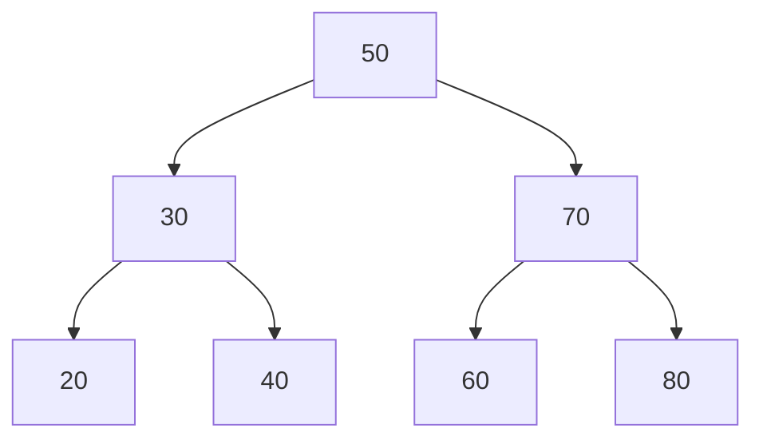

# 📦 Árvore Binária de Busca (ABB)

## 📝 Descrição

A **Árvore Binária de Busca (ABB)** é uma estrutura de dados hierárquica onde cada nó possui no máximo dois filhos (esquerdo e direito). A propriedade fundamental é que para qualquer nó, todos os valores na subárvore esquerda são menores que o valor do nó, e todos os valores na subárvore direita são maiores.

## 📍 Exemplos de Aplicações

- Sistemas de arquivos
- Bancos de dados indexados
- Implementação de dicionários
- Algoritmos de compressão
- Sistemas de roteamento em redes

## ⚙️ Operações Fundamentais

### 🔼 Inserção

> Insere um novo valor mantendo a propriedade de ordenação da ABB.

```c
Tree insert(Tree root, int value) {
  if (root == NULL)
    return createNode(value);
  if (value < root->value)
    root->left = insert(root->left, value);
  else if (value > root->value)
    root->right = insert(root->right, value);
  return root;
}
```

- **Complexidade (Big O):** `O(h)` onde h é a altura da árvore
  - Melhor caso (árvore balanceada): `O(log n)`
  - Pior caso (árvore degenerada): `O(n)`

### 🔍 Busca

> Procura um valor na árvore seguindo a propriedade de ordenação.

```c
Node* search(Tree root, int value) {
    if (root == NULL || root->value == value)
        return root;
    if (value < root->value)
        return search(root->left, value);
    return search(root->right, value);
}
```

- **Complexidade (Big O):**
  - Melhor caso (raiz): `O(1)`
  - Caso médio (árvore balanceada): `O(log n)`
  - Pior caso (árvore degenerada): `O(n)`

### ❌ Remoção

> Remove um valor mantendo a propriedade de ordenação da ABB.

```c
Node* findMin(Node* node) {
    while (node->left != NULL)
        node = node->left;
    return node;
}

Node* delete(Node* root, int value) {
    if (root == NULL) return root;

    if (value < root->value)
        root->left = delete(root->left, value);
    else if (value > root->value)
        root->right = delete(root->right, value);
    else {
        if (root->left == NULL) {
            Node* temp = root->right;
            free(root);
            return temp;
        } else if (root->right == NULL) {
            Node* temp = root->left;
            free(root);
            return temp;
        }
        Node* temp = findMin(root->right);
        root->value = temp->value;
        root->right = delete(root->right, temp->value);
    }
    return root;
}
```

- **Complexidade (Big O):** Similar à busca
  - Melhor caso: `O(1)`
  - Caso médio: `O(log n)`
  - Pior caso: `O(n)`

## 🧠 Representação Visual



## 💡 Observações

- A eficiência das operações depende da altura da árvore
- Uma árvore desbalanceada pode degenerar para uma lista ligada
- É importante liberar a memória recursivamente ao destruir a árvore
- A travessia em ordem (inorder) produz os elementos em ordem crescente

## 📎 Código de Exemplo

```c
typedef struct Node {
  int value;
  struct Node *left;
  struct Node *right;
} Node;

typedef Node *Tree;

Tree createNode(int value) {
  Tree node = (Tree)malloc(sizeof(Node));
  node->value = value;
  node->left = NULL;
  node->right = NULL;
  return node;
}

void inorder(Tree root) {
  if (root) {
    inorder(root->left);
    printf("%d ", root->value);
    inorder(root->right);
  }
}
```
