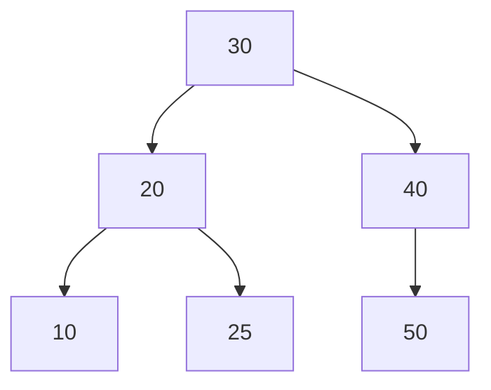

# 📦 Árvore AVL (AVL Tree)

## 📝 Descrição

A **Árvore AVL** é uma árvore binária de busca balanceada onde a diferença de altura entre as subárvores esquerda e direita de qualquer nó não pode ser maior que 1. Esse balanceamento garante que as operações básicas (inserção, busca e remoção) mantenham uma complexidade de O(log n).

## 📍 Exemplos de Aplicações

- Bancos de dados (índices)
- Sistemas de arquivos
- Dicionários
- Conjuntos ordenados
- Aplicações que necessitam de busca rápida e dados ordenados

## ⚙️ Operações Fundamentais

### 🔼 Inserção

> Adiciona um novo elemento mantendo a propriedade de balanceamento da árvore.

Exemplo:

```c
AVLNode *insert(AVLNode *node, int key) {
    // Inserção normal de BST
    if (node == NULL)
        return createNode(key);

    // Rebalanceamento e rotações se necessário
    if (balance > 1 && key < node->left->key)
        return rightRotate(node);
}
```

- **Complexidade (Big O):** `O(log n)`

### 🔍 Busca

> Procura um elemento na árvore de forma similar a uma BST comum.

Exemplo:

```c
AVLNode *search(AVLNode *root, int key) {
    if (root == NULL || root->key == key)
        return root;
    if (key < root->key)
        return search(root->left, key);
    return search(root->right, key);
}
```

- **Complexidade (Big O):** `O(log n)`

### ❌ Rotações

> Operações fundamentais para manter o balanceamento da árvore.

Exemplo de rotação à direita:

```c
AVLNode *rightRotate(AVLNode *y) {
    AVLNode *x = y->left;
    AVLNode *T2 = x->right;
    x->right = y;
    y->left = T2;
    return x;
}
```

- **Complexidade (Big O):** `O(1)`

## 🧠 Representação Visual



## 💡 Observações

- A árvore AVL mantém-se balanceada automaticamente após cada inserção ou remoção
- O fator de balanceamento de cada nó deve ser -1, 0 ou 1
- As rotações são essenciais para manter o balanceamento
- A altura da árvore é sempre O(log n), garantindo operações eficientes

## 📎 Código de Exemplo

```c
typedef struct AVLNode {
    int key;
    struct AVLNode *left;
    struct AVLNode *right;
    int height;
} AVLNode;

AVLNode *createNode(int key) {
    AVLNode *node = malloc(sizeof(AVLNode));
    node->key = key;
    node->left = NULL;
    node->right = NULL;
    node->height = 1;
    return node;
}

int getBalance(AVLNode *node) {
    if (node == NULL)
        return 0;
    return height(node->left) - height(node->right);
}
```
