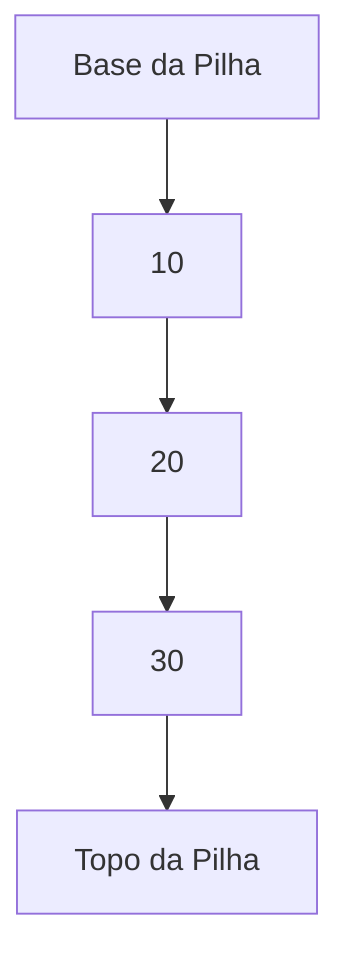

# 📦 Nome da Estrutura de Dados

## 📝 Descrição

Breve descrição da estrutura.  
> Exemplo: A **Pilha (Stack)** é uma estrutura linear onde o último elemento inserido é o primeiro a ser removido (LIFO - Last In, First Out).


## 📍 Exemplos de Aplicações

- Navegadores (voltar/avançar páginas)
- Interpretação de expressões matemáticas
- Execução de chamadas de função
- Undo/Redo em editores
- Algoritmos de backtracking (ex: labirintos)

## ⚙️ Operações Fundamentais

### 🔼 Inserção (push/adicionar)

> Adiciona um novo elemento ao topo da estrutura.

Exemplo com variável simples:
```c
stack[top] = valor;
top++;
````

* **Complexidade (Big O):** `O(1)`


### 🔍 Busca (acesso/consulta)

> Acesso ao elemento mais recente ou algum índice específico (dependendo da estrutura).

Exemplo:

```c
int ultimo = stack[top - 1];
```

* **Complexidade (Big O):**

  * Pilha: `O(1)` para o topo
  * Lista/vetor: `O(1)` por índice, `O(n)` por valor


### ❌ Remoção (pop/remover)

> Remove o elemento mais recente (ou da frente, no caso de fila).

Exemplo:

```c
top--;
int removido = stack[top];
```

* **Complexidade (Big O):** `O(1)`

<br>

## 🧠 Representação Visual



<br>

## 💡 Observações

* A pilha pode ser implementada com arrays fixos ou listas dinâmicas.
* Deve-se verificar **estouro** (overflow) e **vazio** (underflow) antes de `push` ou `pop`.

## 📎 Código de Exemplo

```c
#define SIZE 100
int stack[SIZE];
int top = 0;

void push(int valor) {
    if (top < SIZE) {
        stack[top++] = valor;
    }
}

int pop() {
    if (top > 0) {
        return stack[--top];
    }
    return -1; // erro
}
```
