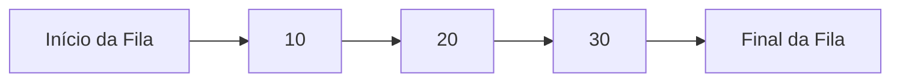

# 📦 Fila (Queue)

## 📝 Descrição

A **Fila (Queue)** é uma estrutura de dados linear onde o primeiro elemento inserido é o primeiro a ser removido (FIFO - First In, First Out). Ela funciona de maneira similar a uma fila do mundo real, onde a primeira pessoa a entrar é a primeira a ser atendida.

## 📍 Exemplos de Aplicações

- Gerenciamento de processos em sistemas operacionais
- Impressão de documentos (fila de impressão)
- Buffers de dados em transmissões
- Gerenciamento de requisições em servidores
- Algoritmos de busca em largura (BFS)

## ⚙️ Operações Fundamentais

### 🔼 Inserção (enqueue)

> Adiciona um novo elemento ao final da fila.

Exemplo com array circular:
```c
if (!isFull(queue)) {
    queue->items[++queue->rear] = value;
}
```

* **Complexidade (Big O):** `O(1)`

### 🔍 Busca (acesso/consulta)

> Acesso ao primeiro elemento da fila (front).

Exemplo:
```c
int primeiro = queue->items[queue->front];
```

* **Complexidade (Big O):** `O(1)` para o primeiro elemento

### ❌ Remoção (dequeue)

> Remove o elemento do início da fila.

Exemplo:
```c
if (!isEmpty(queue)) {
    queue->front++;
}
```

* **Complexidade (Big O):** `O(1)`

<br>

## 🧠 Representação Visual



<br>

## 💡 Observações

* A fila pode ser implementada com arrays fixos ou listas dinâmicas
* É importante verificar condições de **fila cheia** (overflow) e **fila vazia** (underflow)
* Em implementações com array fixo, é comum usar uma estrutura circular para melhor aproveitamento do espaço
* Os índices `front` e `rear` são fundamentais para controlar o início e fim da fila

## 📎 Código de Exemplo

```c
#define QUEUE_SIZE 10

typedef struct {
    int items[QUEUE_SIZE];
    int front;
    int rear;
} Queue;

void initQueue(Queue *queue) {
    queue->front = 0;
    queue->rear = -1;
}

void enqueue(Queue *queue, int value) {
    if (!isFull(queue)) {
        queue->items[++queue->rear] = value;
    }
}

void dequeue(Queue *queue) {
    if (!isEmpty(queue)) {
        queue->front++;
    }
}
```
