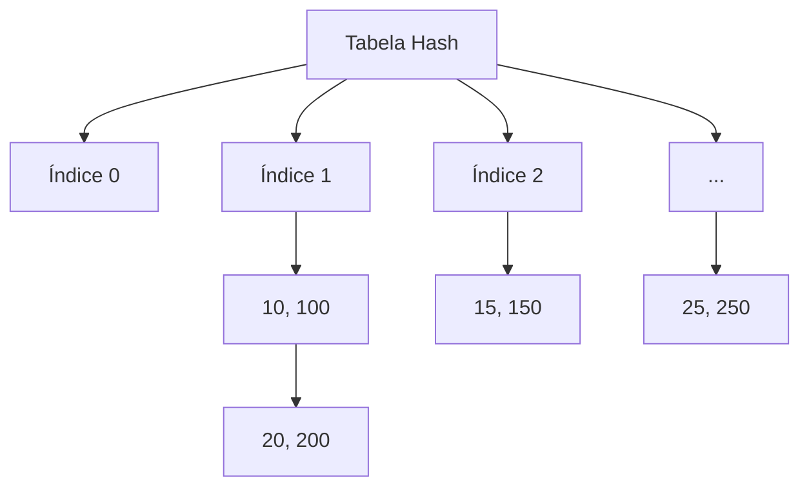

# 📦 Tabela Hash (Hash Table)

## 📝 Descrição

A **Tabela Hash** é uma estrutura de dados que implementa um array associativo, mapeando chaves para valores através de uma função hash. Ela usa uma função de hash para calcular um índice em um array onde o valor desejado pode ser encontrado.

## 📍 Exemplos de Aplicações

- Implementação de dicionários e conjuntos
- Cache de dados
- Indexação de bancos de dados
- Detecção de duplicatas
- Armazenamento de senhas (com funções hash criptográficas)
- Compiladores (tabela de símbolos)

## ⚙️ Operações Fundamentais

### 🔼 Inserção

> Insere um novo par chave-valor na tabela hash.

```c
void insert(HashNode **table, int key, int value, int tableSize) {
  int index = hashFunction(key, tableSize);
  HashNode *newNode = createNode(key, value);

  if (table[index] == NULL) {
    table[index] = newNode;
  } else {
    HashNode *current = table[index];
    while (current->next != NULL) {
      current = current->next;
    }
    current->next = newNode;
  }
}
```

- **Complexidade (Big O):**
  - Caso médio: `O(1)`
  - Pior caso: `O(n)` (com muitas colisões)

### 🔍 Busca

> Busca um valor associado a uma chave na tabela.

```c
int search(HashNode **table, int key, int tableSize) {
  int index = hashFunction(key, tableSize);
  HashNode *current = table[index];

  while (current != NULL) {
    if (current->key == key) {
      return current->value;
    }
    current = current->next;
  }
  return -1;
}
```

- **Complexidade (Big O):**
  - Caso médio: `O(1)`
  - Pior caso: `O(n)` (com muitas colisões)

### ❌ Remoção

> Remove um par chave-valor da tabela hash.

```c
void delete(HashNode **table, int key, int tableSize) {
  int index = hashFunction(key, tableSize);
  HashNode *current = table[index];
  HashNode *prev = NULL;

  while (current != NULL) {
    if (current->key == key) {
      if (prev == NULL) {
        table[index] = current->next;
      } else {
        prev->next = current->next;
      }
      free(current);
      return;
    }
    prev = current;
    current = current->next;
  }
}
```

- **Complexidade (Big O):**
  - Caso médio: `O(1)`
  - Pior caso: `O(n)` (com muitas colisões)

## 🧠 Representação Visual



## 💡 Observações

- A função hash deve distribuir as chaves uniformemente para evitar colisões
- Existem diferentes métodos para tratar colisões:
  - Encadeamento (implementado neste exemplo)
  - Endereçamento aberto (linear probing, quadratic probing, double hashing)
- O fator de carga (número de elementos / tamanho da tabela) afeta o desempenho
- É importante escolher um tamanho de tabela adequado para a aplicação

## 📎 Código de Exemplo

```c
// Função hash simples
int hashFunction(int key, int tableSize) {
    return key % tableSize;
}

// Criar novo nó
HashNode *createNode(int key, int value) {
    HashNode *newNode = (HashNode *)malloc(sizeof(HashNode));
    newNode->key = key;
    newNode->value = value;
    newNode->next = NULL;
    return newNode;
}

// Inicializar tabela
HashNode **hashTable = (HashNode **)malloc(tableSize * sizeof(HashNode *));
for (int i = 0; i < tableSize; i++) {
    hashTable[i] = NULL;
}
```
