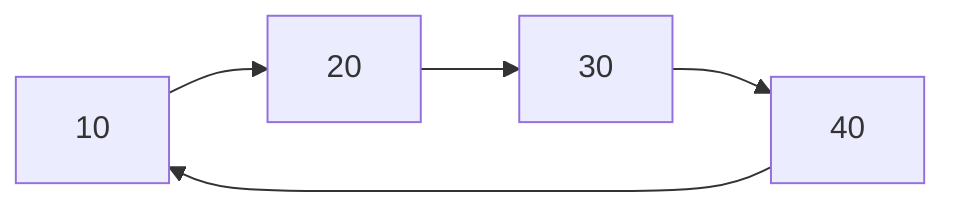

# 📦 Lista Ligada Circular

## 📝 Descrição

A **Lista Ligada Circular** é uma estrutura de dados linear onde cada nó contém um dado e um ponteiro para o próximo elemento, sendo que o último nó aponta de volta para o primeiro, formando um ciclo. Diferente da lista ligada linear, não existe um "fim" da lista, pois ela forma um círculo completo.

## 📍 Exemplos de Aplicações

- Gerenciamento de processos em sistemas operacionais (Round Robin)
- Implementação de playlists de música (reprodução em loop)
- Jogos de turno onde os jogadores se alternam ciclicamente
- Buffers circulares para streaming de dados
- Implementação de menus rotativos em interfaces

## ⚙️ Operações Fundamentais

### 🔼 Inserção (addNode)

> Adiciona um novo elemento na lista, mantendo a estrutura circular.

```c
void addNode(LinkedList *list, int value) {
  Node *newNode = (Node *)malloc(sizeof(Node));
  newNode->data = value;

  if (list->head == NULL) {
    list->head = newNode;
    list->tail = newNode;
    newNode->next = newNode; // aponta para si mesmo
  } else {
    newNode->next = list->head;
    list->tail->next = newNode;
    list->tail = newNode;
  }

  list->size++;
}
```

* **Complexidade (Big O):** `O(1)`

### 🔍 Busca (percorrer/consulta)

> Percorre a lista até encontrar um elemento ou dar uma volta completa.

```c
Node *current = list->head;
do {
    if (current->data == valorBuscado) {
        return current;
    }
    current = current->next;
} while (current != list->head);
```

* **Complexidade (Big O):** `O(n)` onde n é o número de elementos

### ❌ Remoção (removeNode)

> Remove um elemento específico da lista, mantendo a circularidade.

```c
void removeNode(LinkedList *list, int value) {
  if (list->head == NULL) return;

  Node *current = list->head;
  Node *previous = list->tail;

  do {
    if (current->data == value) {
      if (current == list->head) {
        // remove o primeiro elemento
        list->head = current->next;
        list->tail->next = list->head;
      } else {
        // remove elemento do meio/fim
        previous->next = current->next;
        if (current == list->tail) {
          list->tail = previous;
        }
      }
      free(current);
      list->size--;
      return;
    }
    previous = current;
    current = current->next;
  } while (current != list->head);
}
```

* **Complexidade (Big O):** `O(n)` para encontrar + `O(1)` para remover

## 🧠 Representação Visual



## 💡 Observações

* A lista sempre mantém uma referência para o primeiro (head) e último (tail) elementos
* O último elemento sempre aponta para o primeiro, formando um ciclo
* Não existe "NULL" na lista, exceto quando está vazia
* É importante manter o controle do tamanho para evitar loops infinitos
* Útil quando precisamos de um comportamento cíclico ou circular nos dados

## 📎 Código de Exemplo

```c
typedef struct Node {
  int data;
  struct Node *next;
} Node;

typedef struct {
  Node *head;
  Node *tail;
  int size;
} LinkedList;

void initLinkedList(LinkedList *list) {
  list->head = NULL;
  list->tail = NULL;
  list->size = 0;
}

// Exemplo de uso
int main() {
  LinkedList list;
  initLinkedList(&list);
  
  addNode(&list, 10);
  addNode(&list, 20);
  addNode(&list, 30);
  
  // Percorre a lista circularmente
  Node *current = list.head;
  do {
    printf("%d ", current->data);
    current = current->next;
  } while (current != list.head);
}
```
