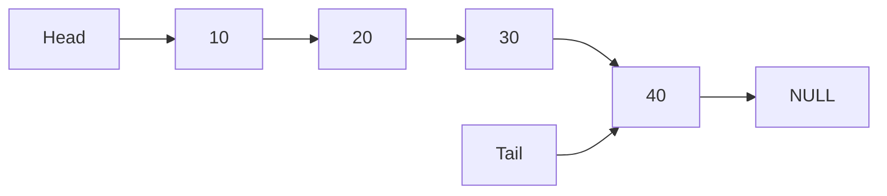

# 📦 Lista Ligada Linear

## 📝 Descrição

A **Lista Ligada Linear (Linear Linked List)** é uma estrutura de dados dinâmica onde cada elemento (nó) contém um valor e uma referência para o próximo elemento. Os elementos não são armazenados em posições contíguas de memória, permitindo uma alocação dinâmica eficiente.

## 📍 Exemplos de Aplicações

- Implementação de pilhas e filas dinâmicas
- Gerenciamento de memória em sistemas operacionais
- Histórico de navegação em aplicações
- Playlists de música
- Editores de texto (para manipulação eficiente de inserções/remoções)

## ⚙️ Operações Fundamentais

### 🔼 Inserção (addNode)

> Adiciona um novo elemento ao final da lista.

```c
void addNode(LinkedList *list, int value) {
  Node *newNode = (Node *)malloc(sizeof(Node));
  newNode->data = value;
  newNode->next = NULL;

  if (list->head == NULL) {
    list->head = newNode;
    list->tail = newNode;
  } else {
    list->tail->next = newNode;
    list->tail = newNode;
  }
  list->size++;
}
```

* **Complexidade (Big O):** `O(1)` (com ponteiro para tail)

### 🔍 Busca

> Percorre a lista procurando por um valor específico.

```c
Node* search(LinkedList *list, int value) {
  Node *current = list->head;
  while (current != NULL) {
    if (current->data == value) {
      return current;
    }
    current = current->next;
  }
  return NULL;
}
```

* **Complexidade (Big O):** `O(n)`

### ❌ Remoção (removeNode)

> Remove um elemento específico da lista.

```c
void removeNode(LinkedList *list, int value) {
  Node *current = list->head;
  Node *previous = NULL;

  while (current != NULL) {
    if (current->data == value) {
      if (previous == NULL) {
        list->head = current->next;
      } else {
        previous->next = current->next;
      }
      if (current->next == NULL) {
        list->tail = previous;
      }
      free(current);
      list->size--;
      return;
    }
    previous = current;
    current = current->next;
  }
}
```

* **Complexidade (Big O):** `O(n)`

## 🧠 Representação Visual



## 💡 Observações

* A lista ligada não requer realocação de memória ao crescer
* Acesso sequencial aos elementos (não permite acesso direto por índice)
* Necessita gerenciamento manual de memória (malloc/free)
* Uso de ponteiro tail otimiza inserção no final
* Ideal para inserções/remoções frequentes em qualquer posição

## 📎 Código de Exemplo

```c
typedef struct Node {
  int data;
  struct Node *next;
} Node;

typedef struct {
  Node *head;
  Node *tail;
  int size;
} LinkedList;

void initLinkedList(LinkedList *list) {
  list->head = NULL;
  list->tail = NULL;
  list->size = 0;
}

void printLinkedList(LinkedList *list) {
  Node *current = list->head;
  while (current != NULL) {
    printf("%d ", current->data);
    current = current->next;
  }
  printf("\n");
}
```
