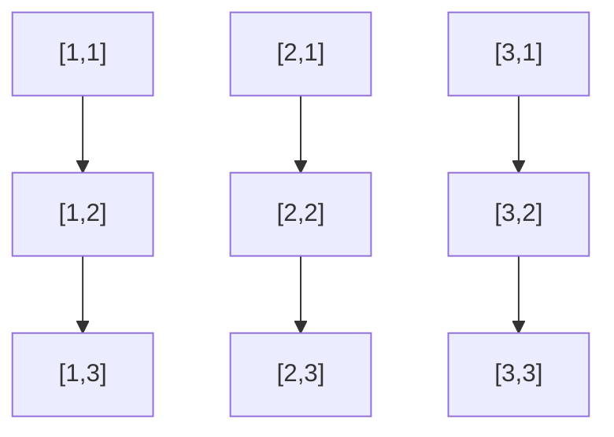

# 📦 Matriz (Matrix)

## 📝 Descrição

A **Matriz** é uma estrutura de dados bidimensional que organiza elementos em linhas e colunas. Pode ser implementada de forma estática (tamanho fixo) ou dinâmica (alocação em tempo de execução).

## 📍 Exemplos de Aplicações

- Processamento de imagens
- Jogos (tabuleiros, mapas)
- Sistemas de coordenadas
- Cálculos matemáticos (álgebra linear)
- Representação de grafos

## ⚙️ Operações Fundamentais

### 🔼 Preenchimento (fill)

> Preenche a matriz com valores (neste caso, aleatórios).

Exemplo com matriz estática:
```c
void fillMatrixWithRandomValues(int matrix[MATRIX_SIZE][CHILD_SIZE], int size) {
  for (int i = 0; i < size; i++) {
    for (int j = 0; j < CHILD_SIZE; j++) {
      matrix[i][j] = rand() % 100 + 1;
    }
  }
}
```

* **Complexidade (Big O):** `O(n*m)` onde n é o número de linhas e m é o número de colunas

### 🔍 Acesso (get)

> Acesso a elementos específicos da matriz usando índices [i][j].

Exemplo:
```c
int elemento = matriz[i][j];
```

* **Complexidade (Big O):** `O(1)` para acesso direto

### 📝 Impressão (print)

> Exibe os elementos da matriz de forma organizada.

Exemplo:
```c
void printMatrix(int matrix[MATRIX_SIZE][CHILD_SIZE], int size) {
  for (int i = 0; i < size; i++) {
    for (int j = 0; j < CHILD_SIZE; j++) {
      printf("%d ", matrix[i][j]);
    }
    printf("\n");
  }
}
```

* **Complexidade (Big O):** `O(n*m)` onde n é o número de linhas e m é o número de colunas

## 🧠 Representação Visual



## 💡 Observações

* Pode ser implementada de forma estática (array bidimensional) ou dinâmica (ponteiros)
* Na implementação dinâmica, é necessário gerenciar a memória manualmente (malloc/free)
* O acesso aos elementos é feito através de dois índices [i][j]
* Na memória, a matriz é armazenada de forma linear (row-major ou column-major)

## 📎 Código de Exemplo

```c
// Matriz estática
int matriz[MATRIX_SIZE][CHILD_SIZE];
fillMatrixWithRandomValues(matriz, MATRIX_SIZE);

// Matriz dinâmica
int *dynamicMatrix = malloc(sizeof(int) * MATRIX_SIZE * CHILD_SIZE);
fillDynamicMatrixWithRandomValues(dynamicMatrix, MATRIX_SIZE);
free(dynamicMatrix); // Importante liberar a memória após o uso
```
