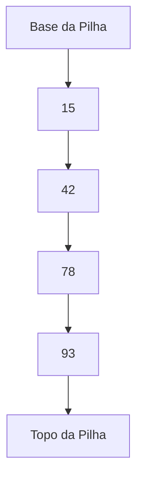

# 📦 Pilha (Stack)

## 📝 Descrição

A **Pilha (Stack)** é uma estrutura de dados linear onde o último elemento inserido é o primeiro a ser removido, seguindo o princípio LIFO (Last In, First Out - Último a Entrar, Primeiro a Sair). Imagine uma pilha de pratos: você sempre adiciona e remove pratos do topo.

## 📍 Exemplos de Aplicações

- Gerenciamento de chamadas de funções em programas (call stack)
- Implementação de operações "desfazer/refazer" (undo/redo)
- Avaliação de expressões matemáticas
- Verificação de parênteses em expressões
- Conversão de números entre diferentes bases
- Algoritmos de backtracking

## ⚙️ Operações Fundamentais

### 🔼 Inserção (push)

> Adiciona um novo elemento ao topo da pilha.

```c
void push(Stack *stack, int value) {
  if (stack->top < STACK_SIZE - 1) {
    stack->items[++stack->top] = value;
  } else {
    printf("Stack overflow\n");
  }
}
```

* **Complexidade (Big O):** `O(1)`

### 🔍 Acesso ao Topo

> Consulta o elemento no topo da pilha sem removê-lo.

```c
int peek(Stack *stack) {
    if (stack->top >= 0) {
        return stack->items[stack->top];
    }
    return -1; // pilha vazia
}
```

* **Complexidade (Big O):** `O(1)`

### ❌ Remoção (pop)

> Remove o elemento do topo da pilha.

```c
void pop(Stack *stack) {
  if (stack->top >= 0) {
    stack->top--;
  } else {
    printf("Stack underflow\n");
  }
}
```

* **Complexidade (Big O):** `O(1)`

## 🧠 Representação Visual



## 💡 Observações

* A pilha pode ser implementada usando arrays (como no nosso exemplo) ou listas encadeadas
* É importante sempre verificar as condições de:
  * **Overflow** (pilha cheia) antes de inserir
  * **Underflow** (pilha vazia) antes de remover
* O tamanho da pilha pode ser fixo (array) ou dinâmico (lista encadeada)
* Todas as operações principais (push, pop, peek) são O(1)

## 📎 Código de Exemplo

```c
#define STACK_SIZE 10

typedef struct {
  int items[STACK_SIZE];
  int top;
} Stack;

void initStack(Stack *stack) {
  stack->top = -1;
}

void push(Stack *stack, int value) {
  if (stack->top < STACK_SIZE - 1) {
    stack->items[++stack->top] = value;
  } else {
    printf("Stack overflow\n");
  }
}

void pop(Stack *stack) {
  if (stack->top >= 0) {
    stack->top--;
  } else {
    printf("Stack underflow\n");
  }
}

void printStack(Stack *stack) {
  if (stack->top == -1) {
    printf("Stack is empty\n");
    return;
  }
  for (int i = stack->top; i >= 0; i--) {
    printf("%d\n", stack->items[i]);
  }
}
```
